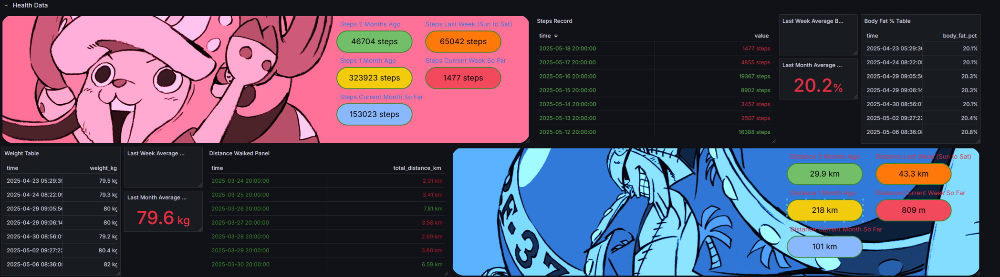

# Google Health / Health Connect SQLite → PostgreSQL Importer for Grafana

This is a small setup to get my Google Health / Health Connect data into PostgreSQL and then into Grafana.

Google gives you a .db SQLite file, so this script handles importing selected tables from the Google Health `.db` into Postgres, running the import on a schedule via a systemd service + timer, and everything from .env

Google automatically exports the health .db file to my googledrive, I set that up to push the file to my server in the folder the script runs from.
So, have a way to sync new daily .db files to the folder, let the importer run daily, and your Grafana dashboards update automatically.