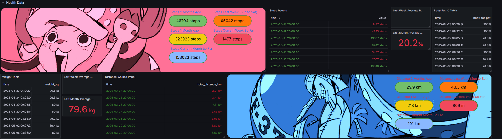

# Google Health / Health Connect SQLite → PostgreSQL Importer for Grafana

This project pulls my Google Health / Health Connect export from Google Drive, extracts the SQLite `.db` file, renames it to `health_data.db`, imports selected tables into PostgreSQL, and makes the data available for Grafana dashboards.

It is designed to run automatically on a schedule using a systemd service + timer, with configuration handled through `.env`.



---

## How it works

Google exports a ZIP file containing the Health Connect SQLite database to Google Drive.

This project then:

1. Uses **rclone** to download the ZIP from Google Drive
2. Extracts the ZIP
3. Finds the first `.db` file inside
4. Renames it to **`health_data.db`**
5. Places it in the importer directory
6. Runs the Python importer
7. Imports selected tables from SQLite into PostgreSQL
8. Lets Grafana read from PostgreSQL

This replaces the old Windows + RaiDrive flow so the pipeline can run entirely on Linux.

---

## Current pipeline

The project now uses these scripts:

- `fetch_health_connect.sh`
  - Downloads the Health Connect ZIP from Google Drive using rclone
  - Extracts it
  - Finds the `.db`
  - Renames it to `health_data.db`
- `run_pipeline.sh`
  - Runs `fetch_health_connect.sh`
  - Then runs `health_data_importer.py`
- `install.sh`
  - Installs dependencies
  - Creates the Python virtualenv
  - Installs Python packages
  - Verifies PostgreSQL connectivity
  - Verifies the rclone remote
  - Creates and enables the systemd service + timer
  - Automatically makes helper scripts executable
- `uninstall.sh`
  - Stops and removes the systemd service + timer

---

## Requirements

- Linux machine
- `systemd`
- Python 3
- PostgreSQL database
- Google Drive account receiving the Health Connect ZIP export
- `rclone` configured for that Google Drive account

---

## rclone setup

This project uses **rclone** instead of RaiDrive like I used before

### 1. Install rclone

```bash
sudo -v
curl https://rclone.org/install.sh | sudo bash
rclone version
